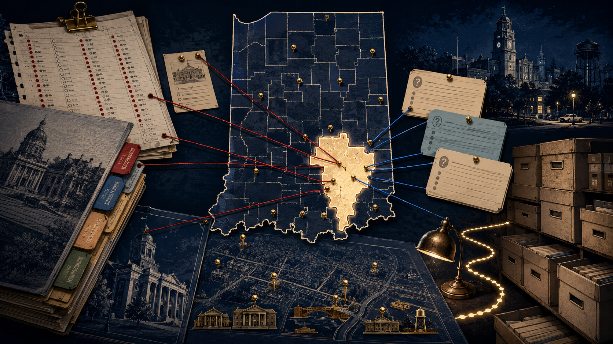

<p align="center">
  
</p>

<p align="center"><sub>Editorial illustration · not a legal district-boundary map</sub></p>

<h1 align="center">The Record — Indiana Sixth District</h1>

<p align="center"><strong>Representation is a record: votes, authority, requests, answers, and unanswered questions.</strong></p>

<p align="center">
  <a href="current/in6/index.html">Open the current audit</a> ·
  <a href="current/sources/index.html">Source ledger</a> ·
  <a href="current/downloads/index.html">Downloads</a> ·
  <a href="current/archive/index.html">Historical route</a>
</p>

A source-bound accountability archive for Indiana's Sixth Congressional District, with a dated current layer and a working route back to the preserved district archive.

## Current release

The current layer is checked through **July 18, 2026** and lives at [`current/in6/index.html`](current/in6/index.html). It adds four source-bound records covering House roll calls, Appropriations authority and project requests, and the 2026 general-election field.

The legacy single-file archive remains preserved under `archive/` when this overlay is applied. The current layer does not claim to independently revalidate every historical entry.

## Evidence boundary

The current layer separates verified facts, significance, stated responses, and open questions. It does not imply that every legacy entry was re-audited on July 18, and its structural validation is not an independent factual review.

## Validate

```bash
python scripts/validate.py
```
